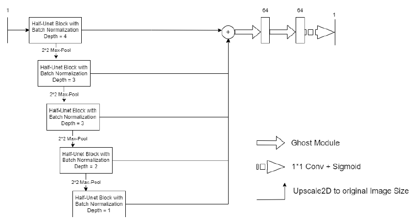
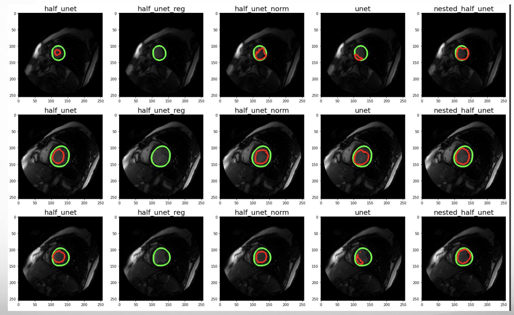

# Half-UNet

## Problem Statament
Medical image segmentation plays a vital role in computer-aided diagnosis procedures. The
main goal of segmenting this data is to identify areas of the anatomy required for a particular
study or medical diagnosis. U-Net is widely used in medical image segmentation. Many variants
of UNet have been proposed, which attempt to improve the network performance while keeping
the U-shaped structure unchanged. However, this U-shaped structure is not necessarily optimal.
In this project, we attempt to analyze the segmentation ability of the existing UNet architecture
and finally a more efficient architecture, Half-UNet and its variants are proposed. The proposed
architectures are also encoder-decoder type architectures (similar to UNet) but in the Half-UNet
architecture both the encoder block as well as the decoder block have been simplified.
Furthermore we propose another architecture based on Half-UNet architecture as well as the
U^2-Net Architecture which in our testing gave even better results. We compared all these
models on a single left ventricular MRI dataset and all the models looked equally efficient with
some having very few trainable parameters.

## Implemented Half-UNet Architecture

## Proposed Nested Half-UNet Architecture

## Results

## Evaluation

## Project Structure Information
### data/ - This directory contains links to data and trained weights
### sources/ - This directory contains research papers implemented / used
### doc/ - This directory contains implementation details for this project
### src/ - This directory contains code files for data pre-processing, model training and model evaluation for all the above mentioned models

